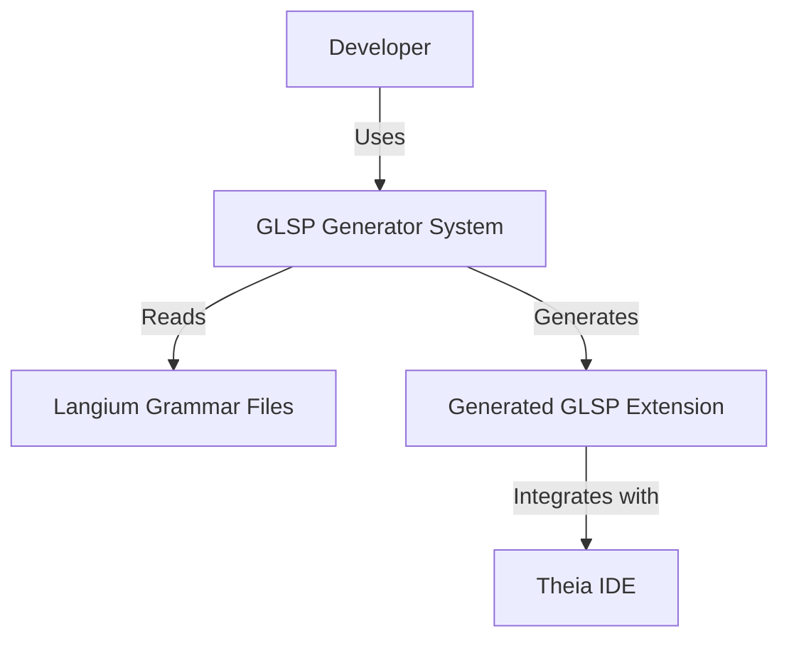
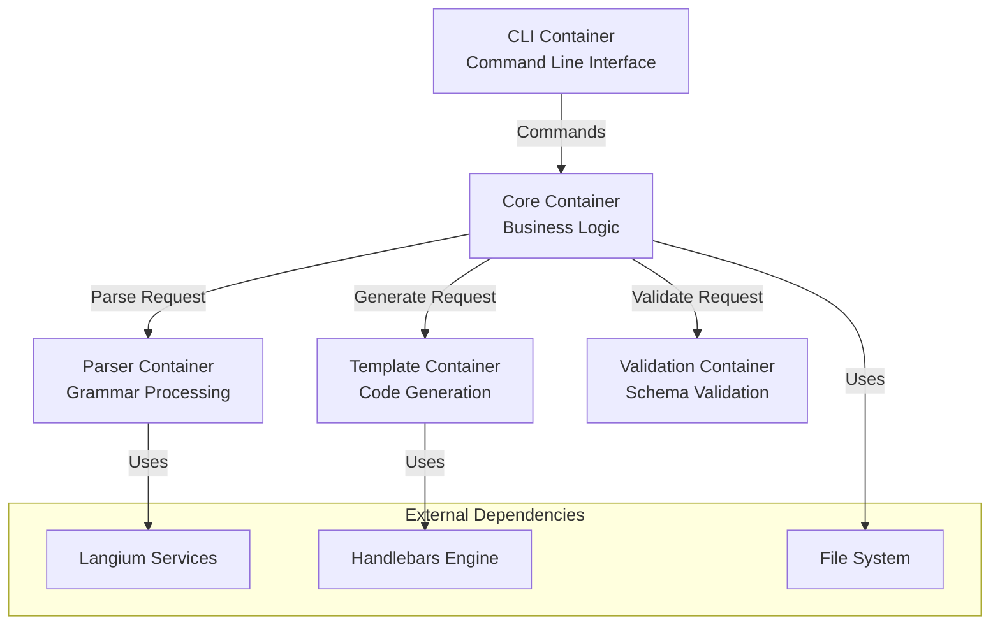
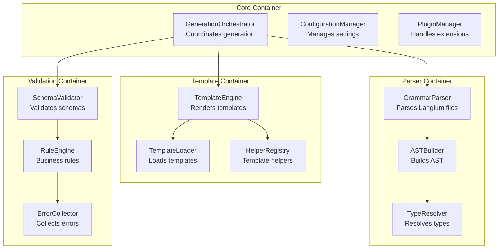

# GLSP Generator - Modular Architecture Design

## Overview

This document outlines the comprehensive modular architecture for the GLSP Generator project, strictly adhering to SOLID principles and clean code practices.

## Architecture Principles

### SOLID Implementation

1. **Single Responsibility Principle (SRP)**
   - Each class has one reason to change
   - Maximum 300 lines per class, 20 lines per method
   - Clear separation of concerns

2. **Open/Closed Principle (OCP)**
   - Extensible plugin architecture
   - New features via extensions, not modifications
   - Strategy pattern for algorithms

3. **Liskov Substitution Principle (LSP)**
   - Polymorphic interfaces for output formats
   - Behavioral consistency across implementations
   - Contract-based design

4. **Interface Segregation Principle (ISP)**
   - Granular interfaces for specific functionalities
   - No fat interfaces
   - Role-based contracts

5. **Dependency Inversion Principle (DIP)**
   - Abstract interfaces for all external dependencies
   - InversifyJS dependency injection
   - Testability through mocking

## C4 Architecture Model

### Level 1: System Context



### Level 2: Container Diagram



### Level 3: Component Diagram



## Module Structure

```
src/
├── core/                       # Core business logic
│   ├── interfaces/            # Abstract interfaces
│   │   ├── IGenerator.ts
│   │   ├── IParser.ts
│   │   ├── IValidator.ts
│   │   └── ITemplateEngine.ts
│   ├── services/              # Concrete implementations
│   │   ├── GenerationOrchestrator.ts
│   │   ├── ConfigurationManager.ts
│   │   └── PluginManager.ts
│   └── models/                # Domain models
│       ├── GrammarModel.ts
│       ├── ExtensionModel.ts
│       └── ValidationResult.ts
├── parser/                     # Grammar parsing module
│   ├── interfaces/
│   │   ├── IGrammarParser.ts
│   │   ├── IASTBuilder.ts
│   │   └── ITypeResolver.ts
│   ├── services/
│   │   ├── LangiumGrammarParser.ts
│   │   ├── ASTBuilder.ts
│   │   └── TypeResolver.ts
│   └── strategies/            # Parser strategies
│       ├── ParserStrategy.ts
│       └── LangiumStrategy.ts
├── templates/                  # Template generation module
│   ├── interfaces/
│   │   ├── ITemplateEngine.ts
│   │   ├── ITemplateLoader.ts
│   │   └── IHelperRegistry.ts
│   ├── services/
│   │   ├── HandlebarsEngine.ts
│   │   ├── FileTemplateLoader.ts
│   │   └── HelperRegistry.ts
│   ├── strategies/            # Rendering strategies
│   │   ├── RenderStrategy.ts
│   │   ├── BrowserStrategy.ts
│   │   ├── ServerStrategy.ts
│   │   └── CommonStrategy.ts
│   └── templates/             # Template files
│       ├── browser/
│       ├── server/
│       └── common/
├── validation/                 # Validation module
│   ├── interfaces/
│   │   ├── IValidator.ts
│   │   ├── IRule.ts
│   │   └── IErrorCollector.ts
│   ├── services/
│   │   ├── SchemaValidator.ts
│   │   ├── RuleEngine.ts
│   │   └── ErrorCollector.ts
│   └── rules/                 # Validation rules
│       ├── GrammarRules.ts
│       ├── NamingRules.ts
│       └── StructureRules.ts
├── infrastructure/             # Infrastructure concerns
│   ├── di/                    # Dependency injection
│   │   ├── container.ts
│   │   ├── bindings.ts
│   │   └── symbols.ts
│   ├── logging/               # Logging infrastructure
│   │   ├── ILogger.ts
│   │   ├── StructuredLogger.ts
│   │   └── LoggerFactory.ts
│   ├── errors/                # Error handling
│   │   ├── ErrorHierarchy.ts
│   │   ├── ErrorCodes.ts
│   │   └── ErrorHandler.ts
│   └── config/                # Configuration
│       ├── IConfigProvider.ts
│       ├── CosmiconfigProvider.ts
│       └── EnvironmentProvider.ts
├── cli/                        # CLI module
│   ├── commands/              # Command implementations
│   │   ├── GenerateCommand.ts
│   │   ├── ValidateCommand.ts
│   │   ├── MigrateCommand.ts
│   │   └── UpgradeCommand.ts
│   ├── interfaces/
│   │   └── ICommand.ts
│   └── CommandRunner.ts
├── plugins/                    # Plugin system
│   ├── interfaces/
│   │   ├── IPlugin.ts
│   │   └── IPluginLoader.ts
│   ├── PluginLoader.ts
│   └── builtin/               # Built-in plugins
│       ├── TheiaPlugin.ts
│       └── VSCodePlugin.ts
└── index.ts                   # Public API exports
```

## Design Patterns Implementation

### 1. Factory Pattern
```typescript
interface IExtensionFactory {
  create(config: ExtensionConfig): IExtension;
}

class ExtensionFactory implements IExtensionFactory {
  constructor(
    @inject(TYPES.IParser) private parser: IParser,
    @inject(TYPES.IValidator) private validator: IValidator,
    @inject(TYPES.ITemplateEngine) private templateEngine: ITemplateEngine
  ) {}

  create(config: ExtensionConfig): IExtension {
    return new Extension(config, this.parser, this.validator, this.templateEngine);
  }
}
```

### 2. Builder Pattern
```typescript
class ExtensionConfigBuilder {
  private config: Partial<ExtensionConfig> = {};

  withGrammar(path: string): this {
    this.config.grammarPath = path;
    return this;
  }

  withOutput(dir: string): this {
    this.config.outputDir = dir;
    return this;
  }

  withPlugins(plugins: string[]): this {
    this.config.plugins = plugins;
    return this;
  }

  build(): ExtensionConfig {
    return new ExtensionConfig(this.config);
  }
}
```

### 3. Strategy Pattern
```typescript
interface IRenderStrategy {
  render(model: GrammarModel, templates: Template[]): GeneratedFiles;
}

class BrowserRenderStrategy implements IRenderStrategy {
  render(model: GrammarModel, templates: Template[]): GeneratedFiles {
    // Browser-specific rendering logic
  }
}

class ServerRenderStrategy implements IRenderStrategy {
  render(model: GrammarModel, templates: Template[]): GeneratedFiles {
    // Server-specific rendering logic
  }
}
```

### 4. Command Pattern
```typescript
interface ICommand {
  execute(args: CommandArgs): Promise<CommandResult>;
  undo?(): Promise<void>;
}

class GenerateCommand implements ICommand {
  constructor(
    @inject(TYPES.IOrchestrator) private orchestrator: IOrchestrator
  ) {}

  async execute(args: CommandArgs): Promise<CommandResult> {
    return await this.orchestrator.generate(args);
  }
}
```

## Dependency Injection Configuration

```typescript
// src/infrastructure/di/symbols.ts
export const TYPES = {
  // Core
  IOrchestrator: Symbol.for('IOrchestrator'),
  IConfigManager: Symbol.for('IConfigManager'),
  IPluginManager: Symbol.for('IPluginManager'),
  
  // Parser
  IParser: Symbol.for('IParser'),
  IASTBuilder: Symbol.for('IASTBuilder'),
  ITypeResolver: Symbol.for('ITypeResolver'),
  
  // Templates
  ITemplateEngine: Symbol.for('ITemplateEngine'),
  ITemplateLoader: Symbol.for('ITemplateLoader'),
  IHelperRegistry: Symbol.for('IHelperRegistry'),
  
  // Validation
  IValidator: Symbol.for('IValidator'),
  IRuleEngine: Symbol.for('IRuleEngine'),
  IErrorCollector: Symbol.for('IErrorCollector'),
  
  // Infrastructure
  ILogger: Symbol.for('ILogger'),
  IConfigProvider: Symbol.for('IConfigProvider'),
  IErrorHandler: Symbol.for('IErrorHandler'),
};

// src/infrastructure/di/container.ts
import { Container } from 'inversify';
import { TYPES } from './symbols';

const container = new Container();

// Core bindings
container.bind(TYPES.IOrchestrator).to(GenerationOrchestrator);
container.bind(TYPES.IConfigManager).to(ConfigurationManager);
container.bind(TYPES.IPluginManager).to(PluginManager);

// Parser bindings
container.bind(TYPES.IParser).to(LangiumGrammarParser);
container.bind(TYPES.IASTBuilder).to(ASTBuilder);
container.bind(TYPES.ITypeResolver).to(TypeResolver);

// Template bindings
container.bind(TYPES.ITemplateEngine).to(HandlebarsEngine);
container.bind(TYPES.ITemplateLoader).to(FileTemplateLoader);
container.bind(TYPES.IHelperRegistry).to(HelperRegistry).inSingletonScope();

// Validation bindings
container.bind(TYPES.IValidator).to(SchemaValidator);
container.bind(TYPES.IRuleEngine).to(RuleEngine);
container.bind(TYPES.IErrorCollector).to(ErrorCollector);

// Infrastructure bindings
container.bind(TYPES.ILogger).to(StructuredLogger);
container.bind(TYPES.IConfigProvider).to(CosmiconfigProvider);
container.bind(TYPES.IErrorHandler).to(ErrorHandler);

export { container };
```

## External Package Replacements

### Current Implementation → Industry Standard Package

1. **Configuration Management**
   - Current: Custom configuration parsing
   - Replace with: `cosmiconfig` - Industry standard for finding and loading configuration

2. **Schema Validation**
   - Current: Custom validation logic
   - Replace with: `zod` - TypeScript-first schema validation with static type inference

3. **File Operations**
   - Current: Native fs module with custom wrappers
   - Replace with: `fs-extra` - Enhanced file operations with promises

4. **Path Matching**
   - Current: Custom glob implementation
   - Replace with: `globby` - User-friendly glob matching

5. **CLI Framework**
   - Current: Basic commander usage
   - Enhance with: `yargs` or `oclif` - More powerful CLI frameworks

6. **Logging**
   - Current: Console.log statements
   - Replace with: `winston` or `pino` - Structured logging with levels

7. **Template Engine**
   - Current: Basic Handlebars
   - Enhance with: `nunjucks` - More powerful templating with inheritance

8. **Testing**
   - Current: Basic Vitest
   - Enhance with: `@testing-library/*` - Better testing utilities

9. **Documentation**
   - Current: Manual JSDoc
   - Enhance with: `typedoc` - Automatic API documentation generation

10. **Code Quality**
    - Current: Basic ESLint
    - Enhance with: `@typescript-eslint/strict` - Stricter type checking

## Performance Optimizations

1. **Lazy Loading**: Load modules only when needed
2. **Caching**: Cache parsed grammars and compiled templates
3. **Parallel Processing**: Use worker threads for large files
4. **Memory Management**: Stream large files instead of loading into memory
5. **Compilation**: Pre-compile templates for faster rendering

## Migration Strategy

### Phase 1: Foundation (Week 1-2)
1. Set up new module structure
2. Implement core interfaces
3. Configure dependency injection
4. Create base abstractions

### Phase 2: Service Extraction (Week 3-4)
1. Extract services from GLSPGenerator
2. Implement SOLID principles
3. Add design patterns
4. Create unit tests

### Phase 3: Integration (Week 5-6)
1. Replace custom implementations with packages
2. Implement plugin architecture
3. Add comprehensive testing
4. Performance optimization

### Phase 4: Documentation (Week 7)
1. Complete JSDoc documentation
2. Create migration guide
3. Update examples
4. Performance benchmarks

## Quality Gates

1. **Code Coverage**: Minimum 90%
2. **Cyclomatic Complexity**: Maximum 10 per method
3. **Duplication**: Maximum 3%
4. **Technical Debt**: Maximum 5 days
5. **Security**: No high/critical vulnerabilities

## Monitoring and Observability

1. **Structured Logging**
   ```typescript
   logger.info('Generation started', {
     correlationId: uuid(),
     grammar: grammarPath,
     output: outputDir,
     timestamp: new Date().toISOString()
   });
   ```

2. **Performance Metrics**
   ```typescript
   @metrics
   async generate(config: Config): Promise<Result> {
     const timer = startTimer();
     try {
       const result = await this.doGenerate(config);
       recordMetric('generation.success', timer.elapsed());
       return result;
     } catch (error) {
       recordMetric('generation.failure', timer.elapsed());
       throw error;
     }
   }
   ```

3. **Health Checks**
   ```typescript
   interface IHealthCheck {
     check(): Promise<HealthStatus>;
   }
   
   class SystemHealthCheck implements IHealthCheck {
     async check(): Promise<HealthStatus> {
       return {
         status: 'healthy',
         checks: {
           parser: await this.checkParser(),
           templates: await this.checkTemplates(),
           filesystem: await this.checkFilesystem()
         }
       };
     }
   }
   ```

## Security Considerations

1. **Input Validation**: Validate all user inputs
2. **Path Traversal**: Prevent directory traversal attacks
3. **Template Injection**: Sanitize template inputs
4. **Dependency Scanning**: Regular vulnerability scanning
5. **Secrets Management**: Never log sensitive information

## Conclusion

This modular architecture provides:
- Clear separation of concerns
- High testability through DI
- Extensibility via plugins
- Maintainability through SOLID principles
- Performance through optimization
- Reliability through comprehensive testing

The architecture is designed to scale with the project's growth while maintaining code quality and developer productivity.