# C4 Architecture Diagrams

## Level 1: System Context Diagram

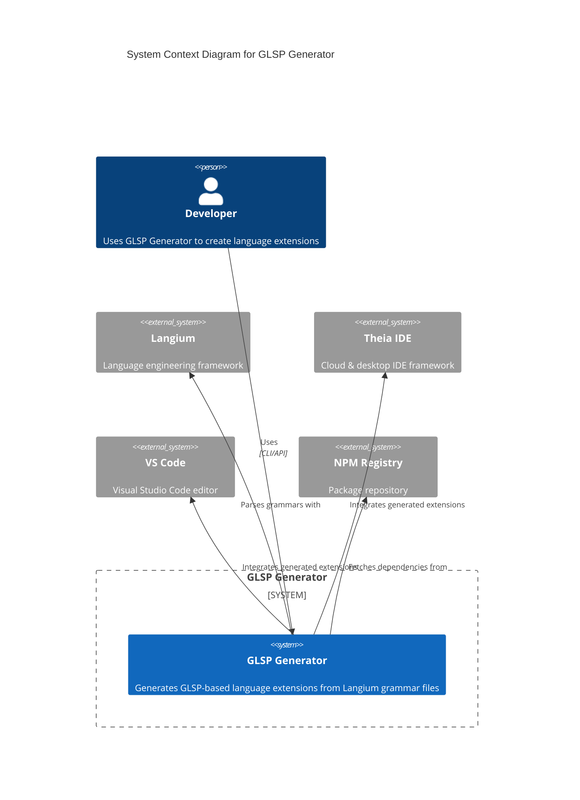

## Level 2: Container Diagram

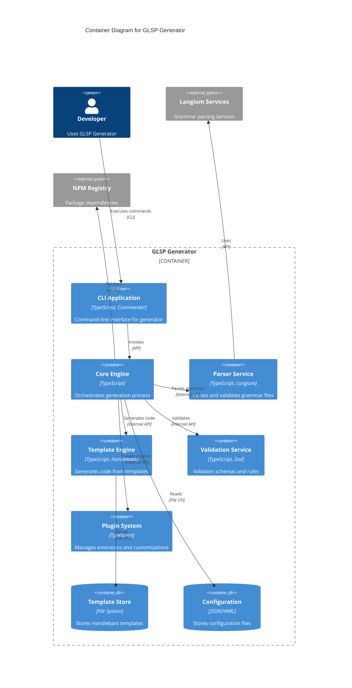

## Level 3: Component Diagram - Core Engine

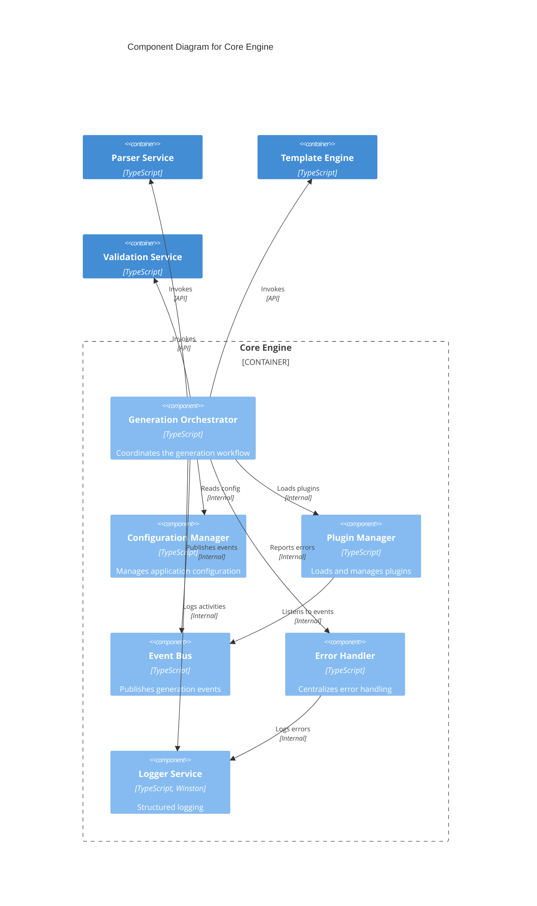

## Level 3: Component Diagram - Parser Service

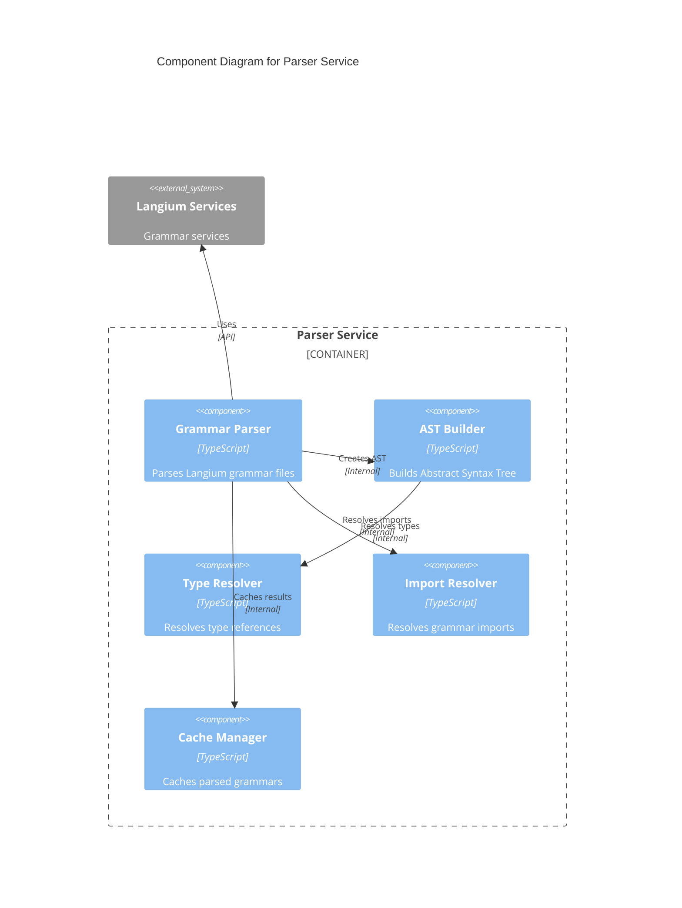

## Level 3: Component Diagram - Template Engine

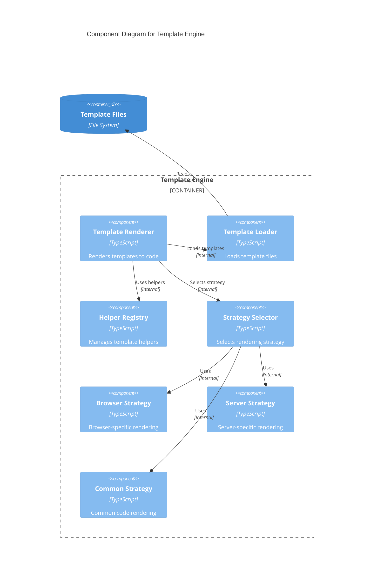

## Level 4: Code Diagram - Generation Orchestrator

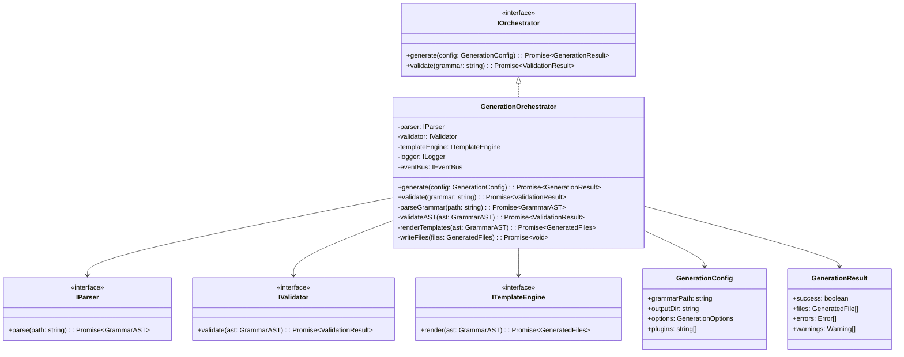

## Sequence Diagrams

### Generation Workflow

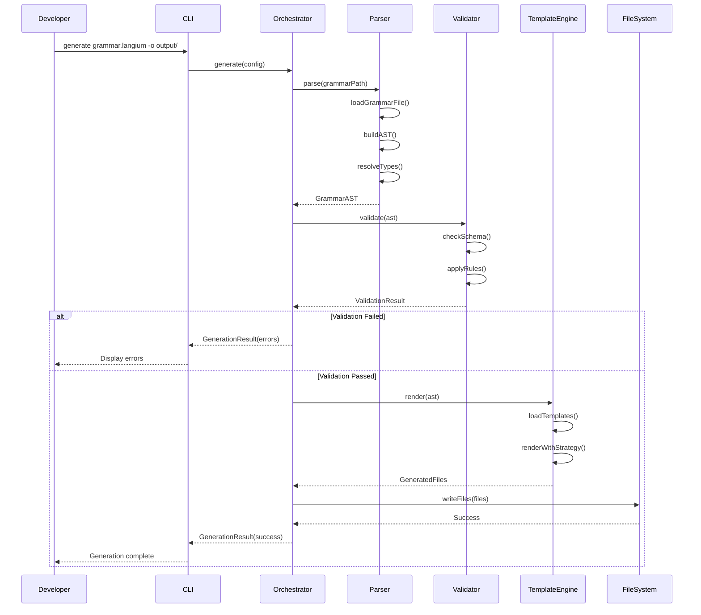

### Plugin Loading Sequence

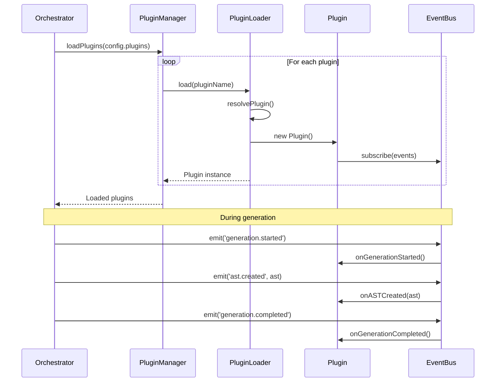

### Error Handling Flow

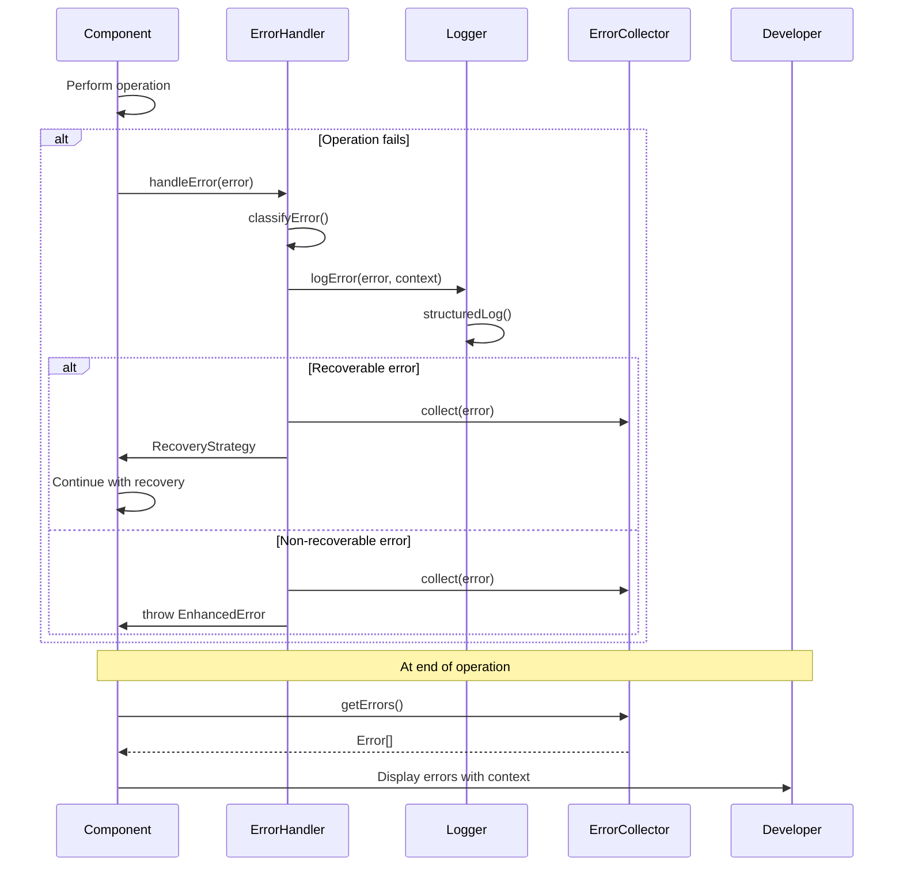

## Deployment Architecture

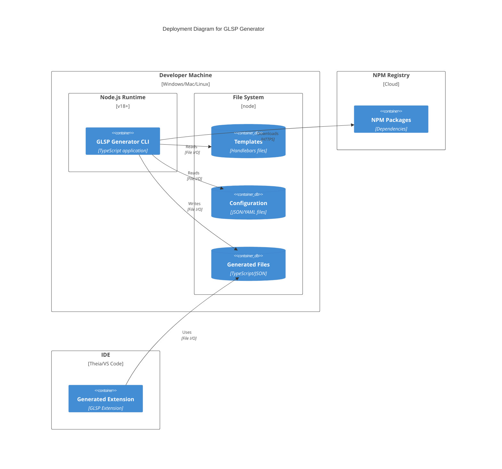

## Data Flow Diagram

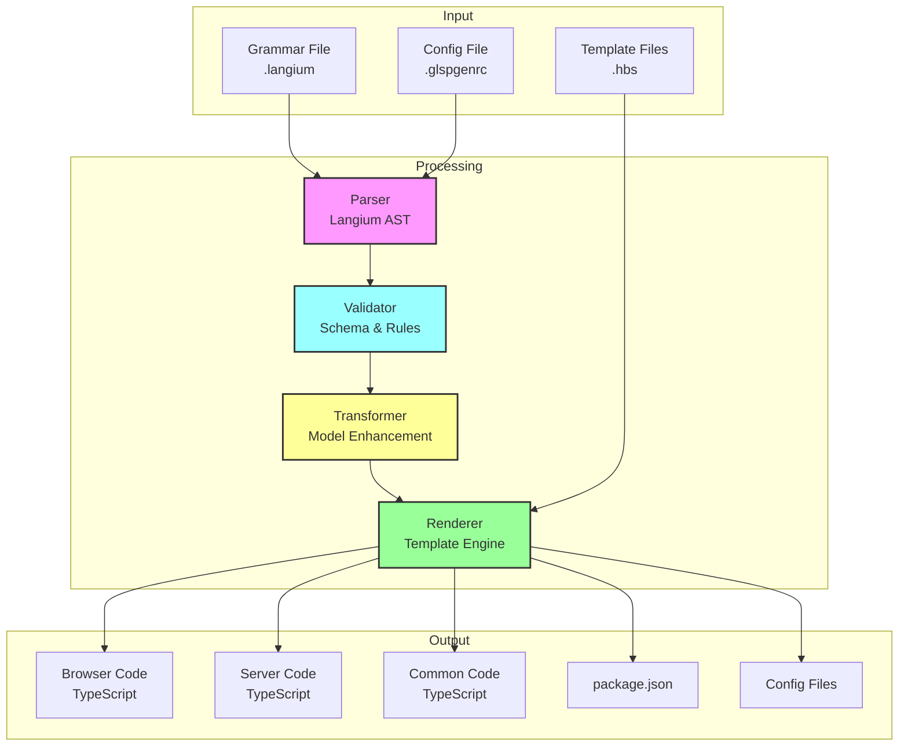