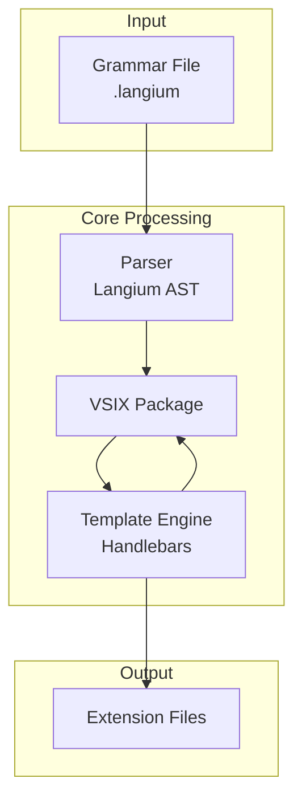

# Prompt 021: Developer Documentation (CONTRIBUTING.md)

## Goal
Create comprehensive developer documentation including CONTRIBUTING.md, architecture overview, and troubleshooting guide that enables new contributors to quickly become productive.

## Why
- No onboarding documentation for new contributors
- Architecture decisions not documented
- Common issues and solutions scattered
- Missing code style guide
- No PR/commit guidelines
- Development workflow unclear

## What
A complete developer documentation suite with contribution guidelines, architecture diagrams, troubleshooting guide, and development workflows.

### Success Criteria
- [ ] CONTRIBUTING.md with clear guidelines
- [ ] Architecture documentation with diagrams
- [ ] Troubleshooting guide for common issues
- [ ] Code style guide with examples
- [ ] PR and commit message templates
- [ ] Development workflow documentation
- [ ] API documentation generation
- [ ] All docs interconnected and discoverable

## Implementation Blueprint

### Phase 1: CONTRIBUTING.md

CREATE CONTRIBUTING.md:
```markdown
# Contributing to GLSP Generator

Thank you for your interest in contributing! This guide will help you get started.

## Table of Contents
- [Code of Conduct](#code-of-conduct)
- [Getting Started](#getting-started)
- [Development Workflow](#development-workflow)
- [Code Style](#code-style)
- [Testing](#testing)
- [Pull Requests](#pull-requests)
- [Architecture](#architecture)

## Code of Conduct
Be respectful, inclusive, and professional. We welcome contributors of all backgrounds.

## Getting Started

### Prerequisites
- Node.js >= 18.0.0
- Yarn 4.x (`corepack enable`)
- Git
- VS Code (recommended)

### Setup
1. Fork and clone the repository
2. Run setup: `yarn setup`
3. Open in VS Code: `code .`
4. Install recommended extensions

### First Contribution
Look for issues labeled `good first issue` or `help wanted`.

## Development Workflow

### 1. Create a feature branch
```bash
git checkout -b feature/your-feature-name
```

### 2. Make changes
- Follow our code style guide
- Add tests for new functionality
- Update documentation

### 3. Test your changes
```bash
yarn test        # Run all tests
yarn test:watch  # Watch mode
yarn doctor      # Check environment
```

### 4. Commit with conventional commits
```bash
git commit -m "feat: add new feature"
git commit -m "fix: resolve issue #123"
git commit -m "docs: update README"
```

## Code Style

### TypeScript
- Use ES modules exclusively
- Prefer async/await over callbacks
- Use strict TypeScript settings
- Document public APIs with JSDoc

### Example
```typescript
/**
 * Parse a Langium grammar file
 * @param filePath - Path to the grammar file
 * @returns Parsed grammar AST
 * @throws {GrammarParseError} If grammar is invalid
 */
export async function parseGrammar(filePath: string): Promise<Grammar> {
  // Implementation
}
```

## Testing

### Test Requirements
- Unit tests for all utilities
- Integration tests for generators
- Minimum 80% code coverage
- Tests must pass on all platforms

### Running Tests
```bash
yarn test              # Run all tests
yarn test:coverage     # With coverage report
yarn test:debug        # Debug mode
yarn test src/utils    # Test specific directory
```

## Pull Requests

### PR Checklist
- [ ] Tests pass locally
- [ ] Code follows style guide
- [ ] Documentation updated
- [ ] Commit messages follow convention
- [ ] PR description explains changes

### PR Template
See `.github/pull_request_template.md`

## Architecture

See [docs/ARCHITECTURE.md](docs/ARCHITECTURE.md) for detailed architecture documentation.

### Key Concepts
- **Monorepo Structure**: Yarn workspaces for package management
- **Generator Pattern**: Template-based code generation
- **Plugin System**: Extensible architecture
- **Error Handling**: Structured error classes with recovery

### Directory Structure
```
glsp-generator/
├── packages/
│   ├── generator/      # Core generator logic
│   └── vscode-extension/  # VS Code integration
├── docs/              # Documentation
├── scripts/           # Development scripts
└── prompts/          # Enhancement prompts
```
```

### Phase 2: Architecture Documentation

CREATE docs/ARCHITECTURE.md:
```markdown
# GLSP Generator Architecture

## Overview
GLSP Generator transforms Langium grammar files into Eclipse GLSP extensions.

## Architecture Diagram


## Component Details

### Parser
- Uses Langium's native parser
- Returns typed AST
- Caches parsed results

### Validator
- Grammar validation rules
- Yarn compatibility checks
- Type safety validation

### Template Engine
- Handlebars templates
- 50+ custom helpers
- Strategy pattern for different outputs

## Data Flow
1. Grammar file loaded
2. Parser creates AST
3. Validator checks rules
4. Templates rendered with AST data
5. Files written to output
6. Optional VSIX packaging
```

### Phase 3: Troubleshooting Guide

CREATE docs/TROUBLESHOOTING.md:
```markdown
# Troubleshooting Guide

## Common Issues

### Build Errors

#### "Cannot find module"
**Cause**: Dependencies not installed or build not run
**Solution**: 
```bash
yarn install
yarn build
```

#### "Template not found"
**Cause**: Templates not copied during build
**Solution**: 
```bash
yarn clean
yarn build
```

### Runtime Errors

#### "Failed to parse grammar"
**Cause**: Invalid grammar syntax
**Solution**: 
1. Check grammar syntax
2. Run validation: `glsp validate your-grammar.langium`
3. See error location and fix

#### Port Already in Use
**Cause**: Previous instance still running
**Solution**:
```bash
yarn docker:stop
# or
lsof -i :51620  # Find process
kill -9 <PID>   # Kill process
```

## Platform-Specific Issues

### Windows
- Use PowerShell (not CMD)
- Enable Developer Mode for symlinks
- Run as Administrator if permission errors

### macOS
- Install Xcode Command Line Tools
- Grant Terminal full disk access

### Linux
- Install build-essential
- May need to increase file watchers
```

### Phase 4: API Documentation

CREATE scripts/generate-api-docs.js:
```javascript
import { Application } from 'typedoc';

async function generateAPIDocs() {
  const app = new Application();
  
  app.options.addReader(new TypeDoc.TSConfigReader());
  app.options.addReader(new TypeDoc.TypeDocReader());
  
  app.bootstrap({
    entryPoints: ['packages/generator/src/index.ts'],
    exclude: ['**/*.test.ts', '**/node_modules/**'],
    plugin: ['typedoc-plugin-markdown'],
    out: 'docs/api',
    readme: 'README.md',
    name: 'GLSP Generator API',
    includeVersion: true,
    excludePrivate: true
  });
  
  const project = app.convert();
  
  if (project) {
    await app.generateDocs(project, 'docs/api');
    console.log('API documentation generated');
  }
}
```

## Final Validation Checklist
- [ ] CONTRIBUTING.md covers all workflows
- [ ] Architecture diagrams are accurate
- [ ] Troubleshooting covers common issues
- [ ] Code examples are correct
- [ ] Links between docs work
- [ ] API docs auto-generate
- [ ] New contributors can onboard easily
- [ ] All platforms covered